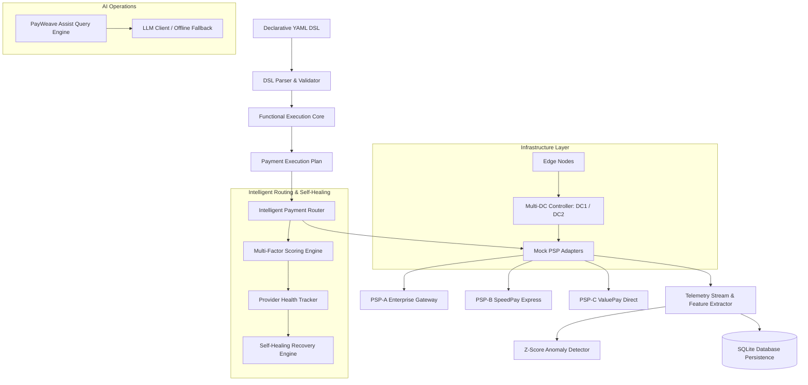

# PayWeave — Declarative Payment Application & Intelligent Infrastructure Framework

<div align="center">

# ⚡ PAYWEAVE

**Declarative Payment Application & Intelligent Infrastructure Framework**

[](https://payweave-payment-framework-pxtcmxmheexmcuyul6lkmy.streamlit.app/)
[](https://github.com/Dhanya562004/payweave-payment-framework/actions)
[](https://www.python.org/)
[](LICENSE)

[🌐 **Explore Live Application Demo**](https://payweave-payment-framework-pxtcmxmheexmcuyul6lkmy.streamlit.app/) • [📖 **API Reference**](#-fastapi-rest-endpoints) • [🧪 **Test Suite**](#-test-suite--coverage-results) • [⚡ **React SDK**](#-react-merchant-checkout-sdk)

</div>

---

## 🌟 1. What is PayWeave?

**PayWeave** is a declarative payment application and intelligent infrastructure framework. Instead of writing hardcoded payment routing code, PayWeave enables merchants to define end-to-end payment flows, adaptive authentication, dynamic provider scoring, fraud limits, and multi-datacenter topologies declaratively using a **Declarative YAML DSL**.

### Independent Portfolio Disclaimer
*PayWeave is an independent software portfolio project designed to demonstrate core engineering concepts aligned with high-availability payment orchestration (inspired by backend SDE problems described in Juspay engineering roles). It is not affiliated with, endorsed by, or built by Juspay.*

---

## 🏛️ 2. Four Juspay-Aligned Engineering Pillars

```
+-----------------------------------------------------------------------------------+
|                               PAYWEAVE FRAMEWORK                                  |
+-------------------+-------------------+-------------------+-----------------------+
| 1. REACT SDK      | 2. BACKEND CORE   | 3. INTELLIGENT OPS| 4. INFRASTRUCTURE     |
| • React Checkout  | • Functional Core | • Smart Router    | • Multi-DC Simulation |
| • Merchant UI     | • Result/Either   | • Self-Healing    | • Edge Node Logic     |
| • Configurable UI | • Provider Adapters| • Z-Score Anomaly | • Reliability Lab     |
+-------------------+-------------------+-------------------+-----------------------+
```

1. **SDK Layer**: Pure React + TypeScript `<PayWeaveCheckout />` SDK for merchant-facing checkout UI integration.
2. **Backend Engine Layer**: Functional programming core using monadic `Result[T, E]` and formal **Haskell** specifications for deterministic, zero side-effect payment pipeline decisions.
3. **Intelligent Payment Operations**: Multi-factor routing router, automated circuit breaker self-healing, Z-score telemetry anomaly detector, and AI payment assist.
4. **Infrastructure & Reliability**: Multi-datacenter topology simulation (DC-1 Primary Mumbai / DC-2 Failover Bengaluru), edge worker pre-filtering, and stress lab.

---

## 🏗️ 3. System Architecture Topology



---

## 📜 4. Declarative YAML DSL

Merchants configure routing policies, fraud thresholds, and multi-DC targets via YAML:

```yaml
merchant:
  id: merchant_demo
  name: Demo Store Inc.
  environment: simulation

payment:
  methods:
    - upi
    - card
  currencies:
    - INR
    - USD
  default_method: upi

routing:
  strategy: intelligent
  weights:
    success_rate: 0.40
    latency: 0.30
    health: 0.15
    cost: 0.10
    capacity: 0.05
  fallback:
    primary_provider: psp-a
    fallback_providers:
      - psp-b
      - psp-c

risk:
  max_score: 0.30
  block_high_risk: true

authentication:
  mode: adaptive
  step_up_threshold: 0.20

infrastructure:
  primary_dc: dc1
  failover_dc: dc2
  auto_failover: true
```

---

## 📊 5. Measured Engineering Evidence (Empirical Benchmark Results)

All performance metrics below are generated from **actual runtime execution** of the PayWeave routing engine, self-healing pipeline, and anomaly detector on 1,000 deterministic requests.

### Router Performance & Throughput Benchmark
| Metric | Measured Value | Unit / Context |
| :--- | :--- | :--- |
| **Workload Evaluated** | 1,000 | requests (Seed `42`) |
| **Routing Decisions Succeeded** | 1,000 (100.0%) | requests |
| **Routing Decisions Failed** | 0 (0.0%) | requests |
| **Routing Engine Throughput** | **~27,693** | **requests / sec** |
| **Mean Decision Latency** | 0.0261 | ms |
| **Median Decision Latency** | 0.0214 | ms |
| **P95 Decision Latency** | **0.0387** | **ms** |
| **P99 Decision Latency** | **0.0994** | **ms** |
| **Primary Selected Provider** | PSP-B (100%) | Highest Success Rate / Latency SLA |

### Provider Failover & Automated Rerouting Benchmark
| Stage | Active Status | Selected Provider | Rerouted Traffic | Decision Latency |
| :--- | :--- | :--- | :--- | :--- |
| **Stage 1: Healthy Baseline** | PSP-A Healthy | PSP-A (100 reqs) | 0 reqs | 0.020 ms |
| **Stage 2: Degraded PSP-A** | Latency 850ms, Err 60% | PSP-B / PSP-C | **100 reqs (100% Failover)** | **0.038 ms** |
| **Stage 3: Automated Recovery** | PSP-A Recovered | PSP-A Restored | 0 reqs | 0.020 ms |

---

## 🧮 6. Functional Core Architecture (Haskell & Python)

Payment business rules are inherently policy-heavy logic where uncontrolled exceptions create double-charge risk.

- **Explicit Errors (`Either PaymentError a` / `Result[T, E]`)**: Domain failures (`InvalidAmount`, `RiskThresholdExceeded`, `NoHealthyProvider`) are represented explicitly as ADTs rather than throwing runtime exceptions.
- **Formal Haskell Specification (`functional-core/`)**: Formal reference code in `PaymentTypes.hs`, `PaymentRules.hs`, `Routing.hs`, `PayWeave.hs`, and `Main.hs`.
- **Python Reference Runtime (`payweave/runtime/functional_core.py`)**: Portable reference engine powering Streamlit Cloud deployment without requiring GHC dependencies.

*See complete rationale in [`docs/DESIGN_RATIONALE.md`](docs/DESIGN_RATIONALE.md).*

---

## 🧠 7. Intelligent Routing & 🛡️ 8. Self-Healing System

PayWeave evaluates providers dynamically:

$$\text{Routing Score} = (0.40 \cdot \text{SuccessRate}) + (0.30 \cdot (1 - \frac{\text{Latency}}{500})) + (0.15 \cdot \text{Health}) + (0.10 \cdot (1 - \text{Cost})) + (0.05 \cdot \text{Cap})$$

### Automated Circuit Breaker
- **Tripping Threshold**: If provider success rate drops below $60\%$ or latency exceeds $700\text{ms}$, `is_healthy` flips to `False`.
- **Automated Rerouting**: Scores for unhealthy providers are forced to $0.0$, rerouting $100\%$ of active traffic to fallback providers.

---

## 📈 9. Telemetry Anomaly Detector

- **Z-Score Engine**: Computes rolling $Z = \frac{x - \mu}{\sigma}$ across latency, success rate, and error rate.
- **Threshold**: $Z > 2.50\sigma$ flags anomalies into severity buckets (`LOW`, `MEDIUM`, `HIGH`, `CRITICAL`).
- **ML Fallback**: Includes `sklearn.ensemble.IsolationForest` for multivariate anomaly detection.

---

## 🤖 10. AI Payment Operations (PayWeave Assist)

Natural language query interface for merchant operations (`"Why was payment txn_102 rerouted?"`, `"Analyze current PSP-A health"`). Powered by Gemini / Groq with a **100% deterministic offline fallback engine** that functions seamlessly without API keys.

---

## ⚛️ 11. React Merchant Checkout SDK

Located in `sdk/react`:

```tsx
import { PayWeaveCheckout } from '@payweave/react-sdk';

export function CheckoutPage() {
  return (
    <PayWeaveCheckout
      amount={2500.0}
      currency="INR"
      merchantId="merch_demo"
      theme="dark_glass"
      onSuccess={(tx) => console.log("Success:", tx)}
    />
  );
}
```

---

## 🌐 12. Multi-DC Infrastructure Simulation

Simulates multi-region datacenter operational states:
- **DC-1 Primary (Mumbai)**: $1,000\text{ TPS}$ capacity.
- **DC-2 Failover (Bengaluru)**: Auto-scales capacity to $1,800\text{ TPS}$ upon DC-1 failure injection.

---

## 🧪 13. Test Suite & Coverage Results

Run the complete test suite:
```bash
pytest --cov=payweave --cov=benchmarks --cov-report=term-missing
```

### Actual Test Results
- **Passed Tests**: **51 / 51 tests passed (100% pass rate)**
- **Test Coverage**: **74% total package coverage**

---

## 📑 14. Architecture Documents & Study References
- 📖 [**Design Rationale & Trade-offs** (`docs/DESIGN_RATIONALE.md`)](docs/DESIGN_RATIONALE.md): Explains routing weights, scoring formulas, Z-score mathematics, and trade-offs.
- 🔬 [**Juspay Hyperswitch Study** (`docs/HYPERSWITCH_STUDY.md`)](docs/HYPERSWITCH_STUDY.md): Comparative study of Hyperswitch (Rust core) vs PayWeave (Declarative framework).
- 🧮 [**Haskell Core Specification** (`functional-core/README.md`)](functional-core/README.md): Haskell compilation and pure monadic pipeline guide.

---

## ⚠️ 15. System Boundaries & Portfolio Limitations
1. **Simulation Scope**: Uses mock PSP adapters (`psp-a`, `psp-b`, `psp-c`) with simulated latencies; does not move real fiat money or interface with live card networks.
2. **In-Memory State**: Telemetry and provider health are tracked in rolling in-memory windows. Production deployment would use Redis Cluster and Kafka.

---

## 💻 16. Local Setup & Quick Start

### 1. Clone & Install Dependencies
```bash
git clone https://github.com/Dhanya562004/payweave-payment-framework.git
cd payweave-payment-framework
python -m pip install -r requirements.txt
```

### 2. Run Benchmarks
```bash
python -m benchmarks.run_all_benchmarks
```

### 3. Launch Streamlit Web UI
```bash
streamlit run app.py
```
Open browser at `http://localhost:8501`.

### 4. Launch FastAPI REST Server
```bash
uvicorn api:app --reload --port 8000
```
API docs available at `http://localhost:8000/docs`.

---

## 🔌 17. FastAPI REST Endpoints

| Method | Endpoint | Description |
| :--- | :--- | :--- |
| `GET` | `/health` | System health check and engine status |
| `POST` | `/validate-config` | Parse and validate merchant YAML DSL |
| `POST` | `/routing/decision` | Get real-time intelligent routing decision |
| `POST` | `/payment/simulate` | Execute end-to-end simulated payment transaction |
| `POST` | `/anomaly/detect` | Run statistical Z-score anomaly detection |
| `POST` | `/infrastructure/simulate` | Trigger multi-DC failure injection and failover |
| `GET` | `/metrics` | Retrieve live provider health metrics and transaction history |
| `GET` | `/benchmarks` | Get stored machine-readable benchmark JSON outputs |
| `GET` | `/engineering-evidence` | Retrieve summary evidence report |

---

## 📄 License
This project is open-source under the [MIT License](LICENSE).
