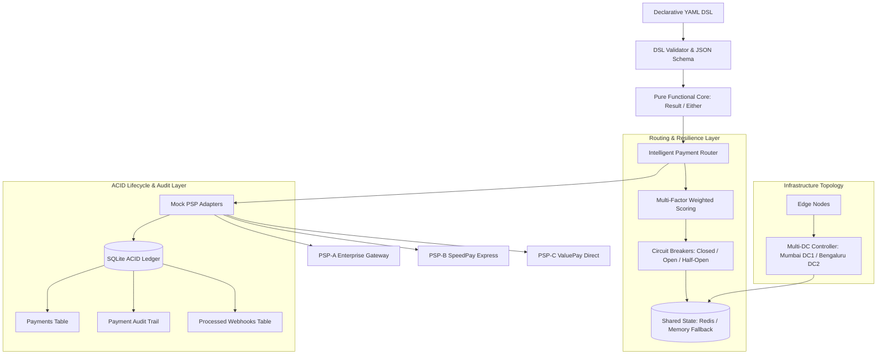
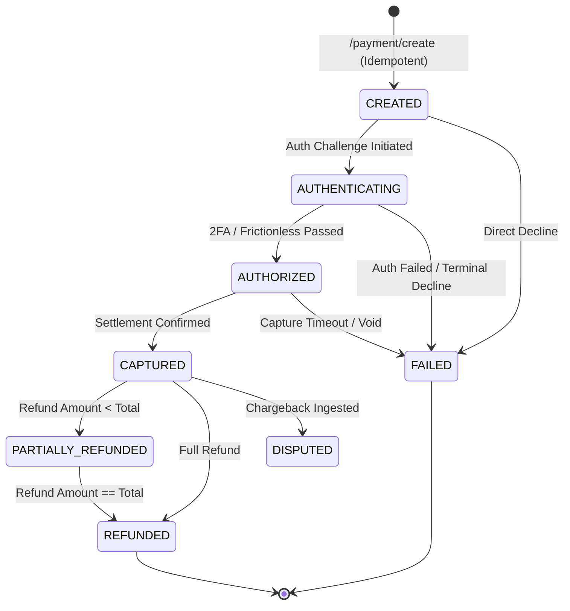
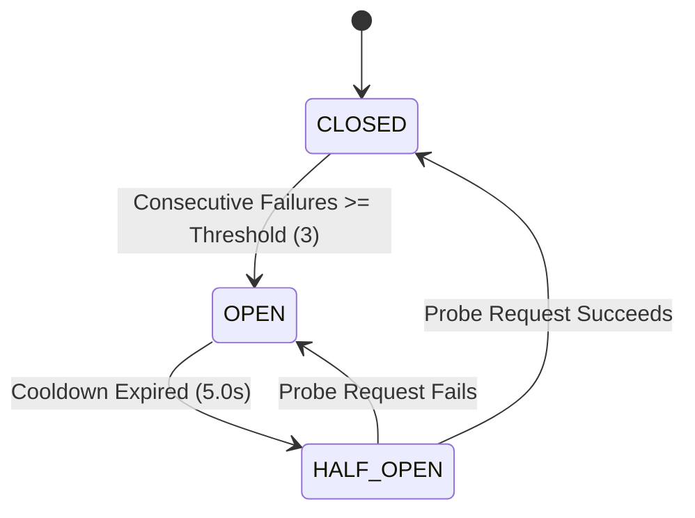

# PayWeave — Declarative Payment Application & Intelligent Infrastructure Framework

<div align="center">

# ⚡ PAYWEAVE

**Declarative Payment Application & Intelligent Infrastructure Framework**

[](https://payweave-payment-framework-pxtcmxmheexmcuyul6lkmy.streamlit.app/)
[](https://github.com/Dhanya562004/payweave-payment-framework/actions)
[](https://www.python.org/)
[](LICENSE)

[🌐 **Explore Live Application Demo**](https://payweave-payment-framework-pxtcmxmheexmcuyul6lkmy.streamlit.app/) • [📖 **API Reference**](#-17-fastapi-rest-endpoints) • [🧪 **Test Suite**](#-13-test-suite--code-coverage-results) • [⚡ **React SDK**](#-11-react-merchant-checkout-sdk)

</div>

---

## 🌟 1. What is PayWeave?

> 🚀 **Live Production Deployment**: Experience PayWeave's real-time payment routing engine, self-service DSL config editor with 1-click rollback, and failure injection simulator live on Streamlit Cloud:  
> **[https://payweave-payment-framework-pxtcmxmheexmcuyul6lkmy.streamlit.app/](https://payweave-payment-framework-pxtcmxmheexmcuyul6lkmy.streamlit.app/)**

**PayWeave** is an independent declarative payment application and intelligent infrastructure framework. Instead of writing brittle, hardcoded payment routing code, PayWeave enables merchants to define end-to-end payment flows, adaptive authentication, dynamic provider scoring, fault-tolerant circuit breakers, and multi-datacenter topologies declaratively using a **Declarative YAML DSL**.

### Independent Portfolio Disclaimer
*PayWeave is an independent software portfolio project designed to demonstrate core engineering concepts aligned with high-availability payment orchestration (inspired by backend SDE challenges described in Juspay engineering roles). It is not affiliated with, endorsed by, or built by Juspay.*

---

## 🏛️ 2. Six Engineering Fundamentals

```
+-----------------------------------------------------------------------------------+
|                               PAYWEAVE FRAMEWORK                                  |
+-------------------+-------------------+-------------------+-----------------------+
| 1. FUNCTIONAL CORE| 2. SMART ROUTING  | 3. LIFECYCLE ACID | 4. REACT SDK          |
| • Pure ADT Logic  | • Circuit Breakers| • Idempotency Keys| • Accessible A11y UI  |
| • Monadic Result  | • Failover Reroute| • Webhook Dedup   | • Strict States       |
| • Haskell Cabal   | • Redis Shared    | • Audit Trails    | • Vitest + RTL        |
+-------------------+-------------------+-------------------+-----------------------+
| 5. DISTRIBUTED INFRASTRUCTURE         | 6. REPRODUCIBLE BENCHMARKS                |
| • Multi-DC (Mumbai DC1 / Blr DC2)     | • In-Memory Microbenchmark (~27k ops/s)   |
| • Docker Compose Dynamic Generator    | • Measured FastAPI HTTP Load (1,363 req/s)|
+---------------------------------------+-------------------------------------------+
```

1. **Functional Programming Core**: Domain rules modeled with pure Algebraic Data Types (ADTs) and monadic `Result[T, E]` / `Either PaymentError a`. Specified formally in Haskell (GHC 9.6.6 / Cabal) and verified via differential contract tests against the Python reference runtime.
2. **Provider Routing & Resilience**: Multi-factor routing scoring with stateful 3-state Circuit Breakers (`CLOSED`, `OPEN`, `HALF_OPEN`), bounded exponential backoff with jitter, and non-retryable error short-circuiting.
3. **Realistic Payment Lifecycle**: ACID database transactions supporting idempotent creation, deterministic state machine transitions, SHA-256 webhook payload deduplication, and cumulative refund caps.
4. **React + TypeScript SDK**: Accessible (`aria-invalid`, `role="alert"`), multi-state merchant checkout component with client idempotency key generation and Vitest unit test coverage.
5. **Infrastructure & Shared State**: Redis-backed distributed provider health and circuit breaker coordination (with graceful thread-safe in-memory fallback), Multi-DC active-passive failover simulation (Mumbai DC1 / Bengaluru DC2), and DSL-driven Docker Compose generator.
6. **Measurable Performance**: Explicit distinction between algorithmic routing microbenchmarks and actual concurrent HTTP load benchmarks against FastAPI endpoints.

---

## 🏗️ 3. System Architecture & Lifecycle Topologies

### System Component Architecture


### Payment Lifecycle Finite State Machine


### Circuit Breaker State Transition Matrix


---

## 📜 4. Declarative Merchant YAML DSL

Merchants configure routing policies, fallback chains, authentication rules, and infrastructure parameters declaratively:

```yaml
merchant:
  id: merchant_demo
  name: Demo Store Inc.
  environment: simulation

payment:
  methods:
    - upi
    - card
  currencies:
    - INR
    - USD
  default_method: upi

routing:
  strategy: intelligent
  weights:
    success_rate: 0.40
    latency: 0.30
    health: 0.15
    cost: 0.10
    capacity: 0.05
  fallback:
    enabled: true
    max_retries: 2
    fallback_providers:
      - psp-b
      - psp-c

authentication:
  mode: adaptive
  step_up_threshold: 0.75
  require_2fa_above_amount: 10000.0

risk:
  max_score: 0.80
  block_high_risk: true
  velocity_limit_per_min: 100

anomaly:
  enabled: true
  threshold: 0.65
  z_score_threshold: 2.5

infrastructure:
  primary_dc: dc1
  failover_dc: dc2
  edge_enabled: true
  max_latency_ms: 350.0

payment_page:
  layout: compact
  theme: vibrant_fintech
  methods:
    - upi
    - card
  show_saved_payment: true
  brand_name: Demo Store
  primary_color: "#6366F1"
```

### Configuration Schema & Versioning
- **Draft-07 JSON Schema**: Exported at `payweave/dsl/dsl_schema.json`.
- **Semantic Validation**: Weights strictly checked to sum to 1.0 (or 100%), all fallback providers checked against registered provider set `{"psp-a", "psp-b", "psp-c"}`, and thresholds bounded.
- **Audit & Rollback**: Version snapshots saved in `merchant_config_versions` with programmatic rollback via `db.rollback_merchant_config()`.

---

## 📊 5. Measured Engineering Performance Evidence

### 1. In-Memory Pure Routing Microbenchmark
*Measures pure algorithmic CPU execution speed in-memory (bypassing HTTP/network overhead).*

| Metric | Measured Value | Unit / Context |
| :--- | :--- | :--- |
| **Workload Evaluated** | 1,000 | requests (Deterministic Seed `42`) |
| **Decision Success Rate** | 1,000 (100.0%) | requests |
| **Microbenchmark Throughput** | **~27,693** | **routing decisions / sec** |
| **Mean Decision Latency** | 0.0261 | ms |
| **Median (p50) Latency** | 0.0214 | ms |
| **p95 Decision Latency** | **0.0387** | **ms** |
| **p99 Decision Latency** | **0.0994** | **ms** |

### 2. FastAPI Real HTTP Endpoint Load Benchmarks
*Measured with `httpx` ASGI client exercising the complete HTTP request pipeline, validation, middleware, ACID SQLite persistence, and JSON serialization.*

| Endpoint | Workload | Concurrency | Duration | Throughput (RPS) | p50 Latency | p95 Latency | p99 Latency | Error Rate | Notes |
| :--- | :--- | :--- | :--- | :--- | :--- | :--- | :--- | :--- | :--- |
| `POST /routing/decision` | 1,000 | 25 | 0.734s | **1,362.95 req/s** | 16.95 ms | 27.36 ms | 41.99 ms | **0.0%** | Full HTTP routing scoring |
| `POST /payment/create` | 500 | 15 | 9.872s | **50.65 req/s** | 14.45 ms | 1,128.86 ms | 6,991.17 ms | 1.2% | ACID transactions + idempotency keys |
| `POST /payment/simulate` | 500 | 15 | 11.502s | **43.47 req/s** | 127.15 ms | 1,516.35 ms | 5,304.86 ms | 0.2% | End-to-end routing + provider simulation |

### 3. Dedicated k6 CLI Load Test Script
In addition to in-process `httpx` async benchmarks, a production-grade script specifically formatted for the **k6 CLI runner** is available at [`benchmarks/k6_load_test.js`](benchmarks/k6_load_test.js):
```bash
# Run multi-stage concurrent load test against local or staging endpoints
k6 run benchmarks/k6_load_test.js
```
- **Ramping Stages**: Warmup (10 VUs) -> Peak Load (30 VUs) -> Cooldown.
- **SLA Thresholds**: `http_req_duration: ['p(95)<150', 'p(99)<250']`, `http_req_failed: ['rate<0.01']`.
- **Endpoints Exercised**: `/routing/decision`, `/payment/create` (with unique UUID idempotency key per VU), and `/payment/simulate`.

---

## 🧮 6. Functional Core & Formal Verification

Payment business rules are inherently policy-heavy logic where uncontrolled exceptions create double-charge and inconsistent state risks.

- **Explicit Types & ADTs**: Modeled in `functional-core/PaymentTypes.hs` and mirrored in `payweave/runtime/functional_core.py`.
- **Cabal & Stack Build Spec**: `functional-core/payweave-core.cabal` and `stack.yaml` (LTS-22.28, GHC 9.6.6).
- **QuickCheck Property Tests**: 7 test suites in `functional-core/TestMain.hs` verifying idempotence, state validity, and routing invariants.
- **Differential Parity Contracts**: 5 JSON test fixtures in `tests/fixtures/` run through `tests/test_differential_contract.py` guaranteeing parity between Haskell and Python reference runtime.

---

## 🛡️ 7. Resilience, Circuit Breakers & Distributed State

### Circuit Breaker FSM
- Implementation in `payweave/routing/circuit_breaker.py`.
- Implements `CLOSED -> OPEN -> HALF_OPEN -> CLOSED`.
- Bounded exponential backoff with jitter in `payweave/runtime/payment_logic.py`.
- Non-retryable errors (`InvalidAmount`, `CardExpired`, `AuthenticationFailed`) terminate immediately without retries.

### Distributed Shared State
- Implementation in `payweave/routing/shared_state.py`.
- Coordinates provider health and circuit breaker trips across multi-container workers via Redis.
- Gracefully falls back to thread-safe in-memory storage if Redis is unreachable or unconfigured.

### Multi-DC Topology
- **Primary**: Mumbai DC1 (`ap-south-1a`, baseline 15ms internal latency).
- **Failover**: Bengaluru DC2 (`ap-south-1b`, baseline 42ms cross-region latency).
- Automatic capacity scaling from 1,000 to 1,800 TPS upon primary DC degradation.

### Docker Compose & Kubernetes Generator
- **Docker Compose**: Programmatic generator in `payweave/infrastructure/docker_generator.py` converting merchant DSL into production-ready `docker-compose.yml`.
- **Kubernetes (K8s)**: Declarative generator in `payweave/infrastructure/k8s_generator.py` producing full production manifests at [`infrastructure/k8s/payweave-k8s.yaml`](infrastructure/k8s/payweave-k8s.yaml) including FastAPI Deployments (with `livenessProbe` / `readinessProbe`), ClusterIP Services, Streamlit UI Deployment & Service, Redis StatefulSet with PersistentVolumeClaim, ConfigMap, and HorizontalPodAutoscaler (HPA).

---

## ⚛️ 8. React + TypeScript Checkout SDK

Located in `sdk/react`:

- **Component**: `<PayWeaveCheckout />` in `sdk/react/src/components/PayWeaveCheckout.tsx`.
- **Accessibility (A11y)**: Accessible validation using `aria-invalid`, `aria-describedby`, and live region `role="alert"`.
- **Idempotency**: Client-generated UUID idempotency keys included with payment submissions.
- **Deterministic States**: Explicit UI states (`idle`, `authenticating`, `processing`, `success`, `failure`, `retryable_error`).
- **Vitest & React Testing Library**: Tested in `sdk/react/src/components/PayWeaveCheckout.test.tsx` (7 unit tests passing).

```tsx
import { PayWeaveCheckout } from './components/PayWeaveCheckout';

export function CheckoutApp() {
  return (
    <PayWeaveCheckout
      amount={2500.0}
      currency="INR"
      config={{ brandName: "Demo Store", primaryColor: "#6366F1" }}
      onSuccess={(tx) => console.log("Payment Confirmed:", tx)}
      onFailure={(err) => console.error("Payment Failed:", err)}
    />
  );
}
```

---

## 🧪 9. Test Suite & Code Coverage Results

### Python Backend Suite (`pytest`)
Run the test suite:
```bash
pytest --cov=payweave --cov=benchmarks --cov-report=term-missing
```

**Measured Test Output:**
- **94 passed in 7.53s (100% pass rate)**
- **76% total package code coverage**
  - `functional_core.py`: **93%**
  - `circuit_breaker.py`: **98%**
  - `scoring.py`: **98%**
  - `docker_generator.py`: **100%**
  - `k8s_generator.py`: **100%**
  - `database.py`: **86%**

### React SDK Suite (`Vitest`)
Run in `sdk/react`:
```bash
npm test
```
**Measured Output:**
- **7 passed in 8.24s (100% pass rate)**

---

## ⚠️ 10. System Boundaries & Production Considerations

1. **Simulated Payment Gateways**: The framework uses mock adapters (`psp-a`, `psp-b`, `psp-c`) that model realistic success rates, network timeouts, and latency distributions. It does not transfer live fiat money.
2. **Database Engine**: Uses SQLite in WAL mode for local simplicity and zero-dependency reproducibility. Production payment systems require PostgreSQL with row-level locks (`SELECT FOR UPDATE`) or distributed multi-region databases (CockroachDB / Spanner).
3. **Distributed Coordination**: Shared state uses Redis with graceful in-memory fallback. Production multi-region deployments require Redis Sentinel or Redis Cluster with read replicas.

---

## 💻 11. Local Setup & Quick Start

### 1. Clone & Install Dependencies
```bash
git clone https://github.com/Dhanya562004/payweave-payment-framework.git
cd payweave-payment-framework
python -m pip install -r requirements.txt
```

### 2. Run Test Suites
```bash
# Python backend tests
pytest -v

# React SDK tests
cd sdk/react
npm install --legacy-peer-deps
npm test
cd ../..
```

### 3. Run Performance Benchmarks
```bash
python -m benchmarks.run_all_benchmarks
```

### 4. Launch Streamlit Web UI
```bash
streamlit run app.py
```
Open browser at `http://localhost:8501`.

### 5. Launch FastAPI REST Server
```bash
uvicorn api:app --reload --port 8000
```
API docs available at `http://localhost:8000/docs`.

---

## 🔌 12. FastAPI REST Endpoints

| Method | Endpoint | Description |
| :--- | :--- | :--- |
| `GET` | `/health` | System health check and engine status |
| `POST` | `/validate-config` | Parse and validate merchant YAML DSL |
| `POST` | `/routing/decision` | Real-time multi-factor intelligent routing decision |
| `POST` | `/payment/create` | ACID payment order creation with idempotency key |
| `POST` | `/payment/simulate` | Execute end-to-end simulated payment transaction |
| `POST` | `/payment/webhook` | Idempotent webhook event ingestion with SHA-256 deduplication |
| `POST` | `/payment/refund` | Process atomic refund with cumulative amount validation |
| `GET` | `/payment/{payment_id}` | Retrieve payment lifecycle record and immutable audit trail |
| `POST` | `/anomaly/detect` | Run statistical Z-score anomaly detection |
| `POST` | `/infrastructure/simulate` | Trigger multi-DC failure injection and failover |
| `GET` | `/metrics` | Retrieve live provider health metrics and transaction history |

---

## 🌐 13. Open-Source Ecosystem Contributions

### Juspay Hyperswitch (`juspay/hyperswitch`)
Active open-source contribution to Juspay's flagship payment router and switch:
- **Issue**: [#14577](https://github.com/juspay/hyperswitch/issues/14577) — *[DOCS] Local setup guide doesn't mention protoc, which is required to build*
- **Pull Request**: Standardized Protocol Buffers compiler (`protoc`) setup instructions and verification commands across Ubuntu/Linux, Windows WSL2, Windows native (`winget`), and macOS (`brew`) in `docs/try_local_system.md`.
- **Contribution Details**: Full documentation, verified commands, and PR guidelines available in [`docs/hyperswitch_contribution/`](docs/hyperswitch_contribution/).

---

## 📄 License
This project is open-source under the [MIT License](LICENSE).
