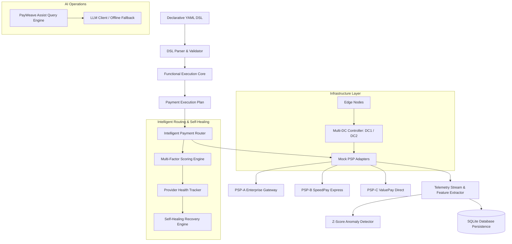

# PayWeave — Declarative Payment Application & Intelligent Infrastructure Framework

[](https://github.com/Dhanya562004/payweave-payment-framework/actions)
[](https://www.python.org/)
[](LICENSE)
[](https://streamlit.io/)

---

## ⚡ What is PayWeave?

**PayWeave** is a declarative payment application and intelligent infrastructure framework. Instead of writing monolithic payment orchestration code, PayWeave allows merchants to define end-to-end payment flows, adaptive authentication policies, dynamic provider routing, risk limits, and infrastructure topologies declaratively using **Declarative YAML DSL**.

### Key Architectural Highlights
- **Declarative Business Logic DSL**: Configure payment rules, risk thresholds, and fallback strategies without editing source code.
- **Functional Rule Engine**: Monadic (`Result` / `Either`) payment execution pipelines based on pure functions and pattern matching. Exposes formal **Haskell Functional Core** specification alongside a portable Python reference runtime.
- **Intelligent Payment Router**: Multi-factor dynamic PSP scoring algorithm balancing success rates, latency SLA, provider health, cost efficiency, and capacity.
- **Automated Self-Healing System**: Real-time provider circuit breaking that detects network degradation, shifts traffic to healthy fallbacks, and logs recovery timelines.
- **Automatic Anomaly Detection**: Statistical Z-score telemetry monitoring identifying latency spikes, success drops, and error rate bursts.
- **Visual Low-Code Flow Builder**: Drag-and-drop workflow builder supporting bidirectional conversion between visual node graphs and YAML DSL specs.
- **Multi-Data-Center & Edge Simulation**: Simulates primary/failover datacenters (DC-1 Mumbai / DC-2 Bengaluru) and edge node interception.
- **AI Payment Operations (PayWeave Assist)**: Natural language operational query engine powered by Gemini/Groq/Together AI with a **100% deterministic offline fallback engine**.
- **Configurable React Merchant Checkout SDK**: Pure TypeScript + React `<PayWeaveCheckout />` SDK for web integration.

---

## 🏗️ System Architecture



---

## 📜 Declarative YAML DSL Specification

```yaml
merchant:
  id: merchant_demo
  name: Demo Store Inc.
  environment: simulation

payment:
  methods:
    - upi
    - card
  currencies:
    - INR
    - USD
  default_method: upi

routing:
  strategy: intelligent
  prefer:
    - lowest_latency
    - highest_success_rate
  weights:
    success_rate: 0.40
    latency: 0.30
    health: 0.15
    cost: 0.10
    capacity: 0.05
  fallback:
    enabled: true
    max_retries: 2
    fallback_providers:
      - psp-b
      - psp-c

authentication:
  mode: adaptive
  step_up_threshold: 0.75
  require_2fa_above_amount: 10000.0

risk:
  max_score: 0.80
  block_high_risk: true

anomaly:
  enabled: true
  threshold: 0.65

infrastructure:
  primary_dc: dc1
  failover_dc: dc2
  edge_enabled: true
```

---

## 🧮 Functional Programming Architecture

PayWeave emphasizes functional programming principles:
- **Algebraic Data Types (ADTs)**: Clean domain representations (`PaymentRequest`, `ProviderHealth`, `AuthDecision`, `RoutingDecision`, `PaymentExecutionPlan`).
- **Monadic Pipelines**: Immutable `Result[T, E]` / `Either` transformations chaining validation, risk evaluation, adaptive security, and routing.
- **Haskell Functional Core**: Located in `functional-core/` (`PaymentTypes.hs`, `Rules.hs`, `Routing.hs`, `PayWeave.hs`) to demonstrate pure functional design.
- **Portable Python Reference Runtime**: Implemented in `payweave/runtime/functional_core.py` so the Streamlit application deploys reliably on Streamlit Cloud without requiring Haskell GHC compilers.

---

## 🧠 Intelligent Provider Routing Algorithm

The Intelligent Router calculates a composite score for each candidate provider:

$$\text{Score} = w_{\text{succ}} \cdot S + w_{\text{lat}} \cdot \left(1 - \frac{L}{L_{\text{ref}}}\right) + w_{\text{health}} \cdot H + w_{\text{cost}} \cdot (1 - C) + w_{\text{cap}} \cdot \frac{\text{Cap}}{100}$$

### Supported Routing Strategies
1. `intelligent`: Dynamic multi-weighted decision balancing all factors.
2. `highest_success_rate`: Prioritizes provider with highest rolling success rate.
3. `lowest_latency`: Prioritizes ultra-low latency providers.
4. `lowest_cost`: Minimizes transaction processing fees.
5. `balanced`: Equal weight distribution across factors.

---

## 🛡️ Self-Healing System & Recovery Timeline

When network latency spikes or provider success rates fall below configured SLAs:
1. **Detection**: `DEGRADATION_DETECTED` event logged.
2. **Circuit Breaking**: Provider health score reduced to zero.
3. **Traffic Shift**: Active payment traffic automatically rerouted to secondary fallback providers.
4. **Recovery**: Once telemetry stabilizes, `RECOVERY_CONFIRMED` event is logged and provider is restored to primary pool.

```text
10:32:04 [WARNING] DEGRADATION_DETECTED: Latency spike (420ms) on PSP-A.
10:32:05 [CRITICAL] HEALTH_SCORE_REDUCED: PSP-A health score set to 0.
10:32:05 [INFO] TRAFFIC_REROUTED: Rerouted active traffic to PSP-B fallback.
10:32:06 [INFO] RECOVERY_CONFIRMED: PSP-A telemetry restored to baseline.
```

---

## 🤖 AI Payment Operations & Offline Fallback

**PayWeave Assist** answers natural language questions regarding system performance, outage causes, and cost optimization.
- **LLM Integration**: Configurable via `GEMINI_API_KEY`, `GROQ_API_KEY`, or `TOGETHER_API_KEY`.
- **100% Deterministic Offline Fallback**: If no API key is provided, PayWeave utilizes a rule-based deterministic response engine. The application **never** breaks due to a missing API key.

---

## ⚛️ React Merchant Checkout SDK

Located in `sdk/react/`:
- Configurable `<PayWeaveCheckout />` component.
- Interactive UPI Intent, VPA validation, Card tokenization simulation, and One-Click checkout.
- Dynamic theme (`dark_glass`, `vibrant_fintech`) and layout modes (`compact`, `standard`).

### Run React SDK Demo locally
```bash
cd sdk/react
npm install
npm run dev
```

---

## 🚀 Quick Start & Installation

### Prerequisites
- Python 3.11+
- Node.js 18+ (optional, for React SDK)

### 1. Clone Repository & Setup Virtual Environment
```bash
git clone https://github.com/Dhanya562004/payweave-payment-framework.git
cd payweave-payment-framework

python -m venv venv
# On Windows:
venv\Scripts\activate
# On Linux/macOS:
source venv/bin/activate

pip install -r requirements.txt
```

### 2. Launch Streamlit Application UI
```bash
streamlit run app.py
```
Open browser at `http://localhost:8501`.

### 3. Launch FastAPI REST API Server
```bash
uvicorn api:app --reload --port 8000
```
Interactive API Documentation available at `http://localhost:8000/docs`.

---

## 🧪 Running Automated Test Suite

PayWeave contains **43 automated test cases** covering DSL parsing, semantic validation, functional rules, routing algorithms, self-healing, anomaly detection, infrastructure simulation, and REST endpoints.

```bash
python -m pytest
```

---

## 🐳 Docker Deployment

```bash
# Build Docker image
docker build -t payweave-framework .

# Run Docker container
docker run -p 8501:8501 -p 8000:8000 payweave-framework
```

---

## 🔌 API Endpoints Reference

| Method | Endpoint | Description |
|---|---|---|
| `GET` | `/health` | Framework health status check |
| `POST` | `/validate-config` | Validates YAML DSL configuration syntax & rules |
| `POST` | `/routing/decision` | Computes intelligent routing decision & rationale |
| `POST` | `/payment/simulate` | Executes simulated payment request & fallback |
| `POST` | `/payment/flow` | Generates visual graph flow nodes |
| `POST` | `/anomaly/detect` | Runs statistical Z-score anomaly detector |
| `POST` | `/infrastructure/simulate` | Simulates multi-DC outage & failover |
| `GET` | `/metrics` | Fetches live telemetry summary & provider health |
| `GET` | `/providers` | Returns list of configured mock PSP adapters |
| `GET` / `POST` | `/merchant/config` | Get or update active merchant DSL configuration |

---

## ⚠️ Portfolio Simulation Limitations

1. **Simulated Payment Gateway**: PayWeave is an architectural simulation framework designed for software architecture demonstration.
2. **Synthetic Telemetry**: Telemetry streams, provider latencies, and success rates are synthetic workload simulations.
3. **No Real Money / Bank Integration**: PayWeave does **NOT** connect to real bank networks, process real financial currency, or handle real payment credentials.
4. **Portable Functional Core**: Streamlit deployment utilizes the Python reference runtime to ensure reliable deployment without requiring GHC compilers on cloud hosts.

---

## 📄 License
Licensed under the [MIT License](LICENSE).
